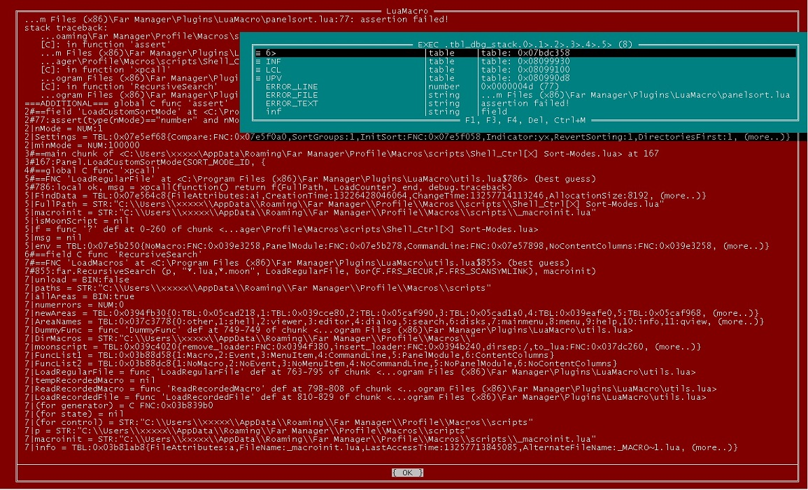
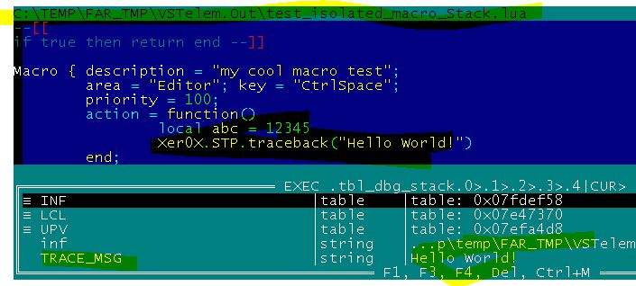

# far-lua-diagnostics
Lua debug trace, fork of <a href="https://github.com/ignacio/StackTracePlus">StackTracePlus @Ignacio</a>, 
will work only in FAR manager environment  
Dependencies: 
https://github.com/dr-dba/far-lua-general-utils 
https://github.com/dr-dba/far-lua-explorer 
 
FAR manager: 
https://farmanager.com/ 
FAR manager forum discussion: 
https://forum.farmanager.com/viewtopic.php?f=15&t=12370 

 
Другой пример исползования 
Что используем: 
1.) Загрузку (можно и выгрузку вышеуказанным способом) одичного фаяла макросов 
ИЗ ПРОИЗВОЛьНОЙ ДИРЕКТОРИИ без перезагрузки 
(обратите внимание из какой трешевой папки это было загружено) 
2.) Использование StackTracePlus@Х для просмотра контекста  
(a не как показыватель ошибок в примере ранее) 
3.) Можно наставить таких tracebacks в любом месте кода,  
и различать их по переданного типа маркера. 
в примере это "Hello World" 

